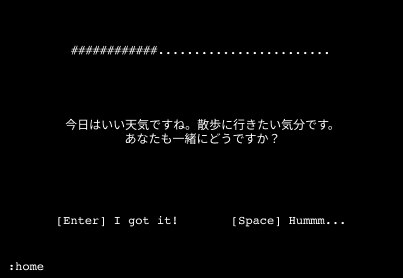

# flush_english

英文をフラッシュ暗算のように答えていくゲーム。

&nbsp;

## なぜ作るのか？

英語（に限らず外国語）を学習するためには、何度も繰り返し繰り返し話すのが良いと思う。フラッシュ暗算のように何度も短い時間で、パパッと英文を繰り返すことによって、すぐに英語が出てくるように、また、感覚で正しい英語と間違った英語がわかるようになれるのではと思ったのがきっかけ。

本当はWebアプリやモバイルアプリとして、実装してみたいと思ったが、まずは最も簡単な形で実装してみて、使い勝手が良さそうならそちらのバージョンを作成してみようと思う。

- フラッシュ暗算のように、パパッと英文を繰り返し答えることで、英文脳が作れるのではないか？
- モバイルアプリやWebアプリとして作る前に、コンソールアプリとして先に作っておきたかった。

&nbsp;

## ターゲット

- 僕：英語の読み・聴きはできるが、アウトプットである、話す・書くが得意ではない。英文のアウトプットをできるだけ増やして英語脳を作りたいと思っている。
  ただし、日頃、あまり時間が取れないので、英語学習のウェイトはできるだけ小さくしたいと考えている。

&nbsp;

## 要件定義

- コンソールアプリとして作成する。
- 日本語文を問題として、英文を解答文とする。
- １日に解くべき問題という、問題リストを毎日作成する。その中から問題を表示していく。達成できた時は、何か褒美を与える。また、どの程度の達成率なのかを表示するようにする。
- 問題が出題される頻度は、エビングハウスの忘却曲線をなどを参考に計算される。（人工知能的な処理を入れても良いかも）
- １日に登録できる問題の数に制限をかける。20くらい。
- これまでの成果が見れるページが欲しい。
- **[全体]**
  - このアプリ内では日本時間が基準であるとする。
  - 各ページでホームページに戻れる方法を確保しておく。
- **[ホーム]**
  - 本日の残りの問題数や、下記の３つのページへ遷移できるようにしたい。
  - タイトルはアスキーアートで表示したい
  - この画面でマスト問題を計算しておく
- **[問題解答]**
  - まずは日本語が表示される。それを見てすぐに英文が言えれば「Enter」、すぐにわからなければ「Space」を押して、問題の解答 (対応する英文)・解説・おまけ情報を表示する。解答に納得したら「Enter」を押して次の問題へ。
  - 現在の達成率を表示
  - １日の最大問題数は100問とする。ただし、それ以上続けたい場合はランダムに問題を出題することにする。
  - １日に解くべきマストな問題は以下のように準備される。
    - 問題を追加したばかりの頃は出題頻度が高く、何度も解答しているものは徐々に出題頻度を落としていく。エビングハウスの忘却曲線の参考にしたい。
    - 解答がすぐに思いつかなかった苦手な問題については、出題頻度を少しだけ高める。
    - 解かれるべき日に問題が解かれていない場合は、下に示す計算式によって、再計算される。
- **[問題編集・追加]**
  - 問題を追加できるようにする
  - 問題を削除できるようにする
  - 問題を検索できるようにする
  - 問題を編集できるようにする
  - １日に追加できる問題数は 20 問とする
  - CSVファイルから問題をインポートできるようにする
    - 既存の問題と重複している場合はスキップする
    - 20問以上の問題がある場合は、手動追加しなかった日に自動追加される
    - インポート結果を出力する
    - CSVのヘッダーは「en,jp,dsc」とする
    - 改行が必要な場合は `\n` を使用することにする
- **[成果]**
  - BarChartとして、これまでの成果を表示
  - 日・週・月の単位で表示できるようにする

&nbsp;

## システム構成

- 問題文などを保存するDBはRDBとして、ローカルPCに存在する

&nbsp;

## 開発技術

- Pythonを使用して、コンソールアプリのフレームワークとして `curses` を使用してみる。
- 問題文などの情報を格納するRDBはMySQLを使用する。
- タイトルのFlushの文字は nodeパッケージの `figlet` を使用して生成する。

&nbsp;

## 画面定義

コンソールアプリなので大まかなアウトラインだけを決めておいて、あとは良しなに実装する。言葉足らずな設計なので、大体自由に実装して良い。

- ホーム (home)
  - 選択しているものに色をつけておく
  - 上部に達成率を表示しておく

- 解答 (solve)
  - 問題は画面の真ん中に表示される
  - 一行に収まりきらない時は改行をする
  - 上部に達成率を表示
  - `:` を打つとページ遷移のモードにできるようにしておく

- 問題編集 (edit)
  - 入力中のものには色をつけて分かりやすくする
    - jp は日本語文
    - en は英語文
    - dsc は追加情報、説明

  - 「Create」など選択中のものは色をつけて分かりやすくしておく
  - 上部に、新規追加であれば「#New Problem」、既存問題の編集であれば「#{Problem Number}」を表示する
  - `/` を打つと検索モードになる
    - jp, en, dsc に入力中であれば検索モードは使用できない。「Create」などを選択しているときだけ検索できる
    - 同様にjp, en, dsc に入力中であれば、`:` によるページ遷移モードを使用できない。

- 成果 (report)
  - 日次、週次、月次のレポートを選べる。
  - アスキーアートによるグラフを生成、表示
  - 達成率が100%を超えている場合は色を変更しておく。
  - グラフの下に詳細な達成率を選択できるようにする。

&nbsp;

## DB設計
